# 🛡️ Velora OS - Akıllı Kişisel Asistan & Şifre Yöneticisi
### (Microservices + AI Agents + Secure Vault + Monitoring)
VeloraAPI is a containerized backend service built with Python.  
The project focuses on REST API development and containerized deployment using Docker.

Not: Proje docker-compose up --build komutu ile çalıştırılmak üzere tasarlanmıştır. Veritabanının (PostgreSQL) sağlık kontrolü (healthcheck) tamamlanmadan Backend servisi başlamayacaktır, bu nedenle ilk açılışta lütfen 30-60 saniye bekleyiniz. Test ortamında port çakışması yaşanmaması için 80 ve 8000 portlarının boş olduğundan emin olunuz.

  
  
  
  
  

---

## 🚀 1. Proje Genel Bakış
**Velora OS**; kullanıcıların günlük görevlerini yönettiği, notlarını tuttuğu ve en önemlisi **hassas şifrelerini güvenle sakladığı** modern bir web platformudur. 

Mikroservis mimarisi üzerine kurulu olan sistem, arka planda çalışan **Yapay Zeka (AI) Ajanları** ile sistem sağlığını denetler ve kullanıcının veri güvenliğini (Password Strength Analysis) aktif olarak analiz eder.

| Proje Künyesi | Detaylar |
| :--- | :--- |
| **Proje Adı** | Velora OS (Purple Edition) |
| **Tür** | Akıllı Kişisel Asistan & Güvenli Veri Kasası |
| **Mimari** | Mikroservis (Docker & Docker Compose) |
| **API Türü** | RESTful API (FastAPI) |
| **Dokümantasyon** | Swagger UI (OpenAPI 3.0) |

---

##  2. Değerlendirme Tablosu (Rubric)

 | Değerlendirme Kriteri | İlgili Dosya/Konum |
 | :--- | :--- |
 | **DockerFile ve Compose Dosyası** | `Dockerfile`, `docker-compose.yml` |
 | **Servisin Ayağa Kalkması** | `depends_on` ve `healthcheck` mekanizması aktif. |
 | **Port Yayını** | Backend: **8000**, Frontend: **80** portunda. |
 | **Swagger Dokümantasyonu** | `/docs` ve `swagger.yaml` |
 | **MermaidJS Kodu** | Aşağıdaki "Sistem Mimarisi" başlığında render edilmiştir. |
 | **JWT/Bearer Korumalı Endpoint** | `/api/tasks`, `/api/passwords` (Token zorunlu) |
 | **Public (Tokensız) Endpoint** | `/metrics` ve `/api/quote` |
 | **Veritabanı (DB)** | **PostgreSQL** (Docker servisi olarak) |
 | ** AI Güvenlik Raporu** | `AI_SECURITY_REPORT.md` (Öneriler koda işlenmiştir) |

---

## 📊 3. Sistem Akış Şeması (Sequence Diagram)
Aşağıdaki diyagram, GitHub üzerinde otomatik olarak render edilmektedir. Kullanıcının sisteme giriş yapması ve **yeni bir şifre kaydederken** sistemin nasıl güvenlik kontrolü yaptığını göstermektedir:

```mermaid
sequenceDiagram
    participant User as Kullanıcı
    participant UI as Frontend (Web)
    participant API as Backend (FastAPI)
    participant DB as Veritabanı (PostgreSQL)

    %% 1. OTURUM AÇMA
    Note over User, DB: 🔐 Kimlik Doğrulama
    User->>UI: Giriş Yap (E-posta/Şifre)
    UI->>API: POST /auth/login
    API->>DB: Kullanıcıyı Sorgula & Hash Kontrolü
    DB-->>API: Onay
    API-->>UI: JWT Access Token (24 Saatlik)
    
    %% 2. ŞİFRE EKLEME VE ANALİZ (ÖNEMLİ)
    Note over User, DB: 🛡️ Şifre Güvenlik Analizi
    User->>UI: "Yeni Şifre Ekle" (Hesap + Şifre)
    UI->>API: POST /api/passwords/{uid}
    
    rect rgb(30, 0, 30)
        API->>API: Token Doğrula (Bearer)
        API->>API: Şifre Gücünü Analiz Et (Regex)
        Note right of API: Kriterler: Uzunluk, Büyük Harf, Sayı
    end
    
    API->>DB: Şifreyi Kaydet (Güç Skoru ile)
    DB-->>API: Kayıt Başarılı
    API-->>UI: "Şifre Eklendi - Güç: Yüksek" Yanıtı

    %% 3. LİSTELEME
    UI->>API: GET /api/passwords/{uid}
    API->>DB: Şifreleri Çek
    DB-->>API: Şifre Listesi
    API-->>UI: Listeyi Ekranda Göster
```

| Alan           | Açıklama                                     |
| -------------- | -------------------------------------------- |
| Proje Adı      | Velora OS (Purple Edition)                   |
| Tür            | Akıllı Kişisel Asistan & Güvenli Veri Kasası |
| Mimari         | Mikroservis                                  |
| Çalışma Ortamı | Docker & Docker Compose                      |
| API Türü       | RESTful API                                  |
| Dokümantasyon  | Swagger (OpenAPI)                            |

| Katman     | Açıklama                                            |
| ---------- | --------------------------------------------------- |
| Frontend   | Kullanıcı arayüzünü sunar, API ile haberleşir       |
| Backend    | İş mantığı, kimlik doğrulama ve veri işlemleri      |
| Veritabanı | Kullanıcı, görev, not ve şifre verilerini saklar    |
| AI Katmanı | Verileri analiz eder ve akıllı geri bildirim üretir |
| Monitoring | Sistem metriklerini toplar ve izler                 |

| Katman       | Teknolojiler                   |
| ------------ | ------------------------------ |
| Frontend     | HTML5, TailwindCSS, JavaScript |
| Backend      | Python, FastAPI, Pydantic      |
| ORM          | SQLAlchemy                     |
| Veritabanı   | PostgreSQL                     |
| Güvenlik     | JWT, Bcrypt                    |
| AI           | Ollama, MCP                    |
| Monitoring   | Prometheus                     |
| Orkestrasyon | Docker, Docker Compose         |

| Özellik          | Açıklama                                        |
| ---------------- | ----------------------------------------------- |
| Kimlik Doğrulama | JWT (Bearer Token)                              |
| Yetkilendirme    | Token olmadan korumalı endpoint’lere erişim yok |
| Şifre Saklama    | Bcrypt ile hashleme                             |
| Veri Erişimi     | Kullanıcı bazlı izolasyon                       |

| Servis          | Port  | Açıklama              |
| --------------- | ----- | --------------------- |
| velora_api      | 8000  | Backend API           |
| velora_frontend | 80    | Web arayüzü           |
| velora_db       | 5432  | PostgreSQL (internal) |
| prometheus      | 9090  | Monitoring            |
| ollama          | 11434 | AI motoru             |
| mcp_server      | -     | AI tool server        |

| Endpoint Türü      | Açıklama                                    |
| ------------------ | ------------------------------------------- |
| Public Endpoint    | Kayıt, giriş, sağlık kontrolü               |
| Protected Endpoint | Görev, not ve şifre işlemleri (JWT gerekli) |

| Özellik       | Açıklama                |
| ------------- | ----------------------- |
| Veri Analizi  | Görev ve not yoğunluğu  |
| Geri Bildirim | Günlük özet ve öneriler |
| Entegrasyon   | Ollama + MCP            |

